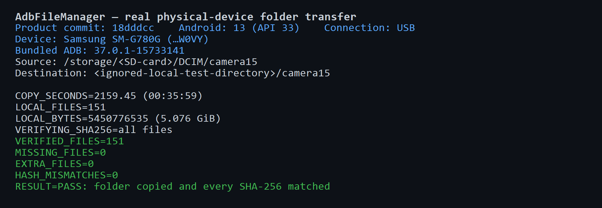

# Real camera folder transfer result — 2026-09-21

## Environment

- Product commit: `18dddcc` (includes transfer reliability changes from `cf38ea0`)
- Device: Samsung SM-G780G (serial masked as `…W0VY`)
- Android: 13, API 33
- Connection: USB
- Bundled ADB: `37.0.1-15733141`
- Source: `/storage/<SD-card>/DCIM/camera15`
- Destination: ignored local test directory
- Production component exercised: `AdbTransferBackend.CopyAsync`

## Result

The complete camera folder was pulled from a physical phone's microSD card through the production transfer backend. The operation completed successfully and the resulting local folder contained **151 files totaling 5,450,776,535 bytes (5.076 GiB)**.

The copy took **2,159.45 seconds (35:59)**, an effective rate of **2.41 MiB/s**. The source was a microSD card and was the limiting storage device during both transfer and verification.

After the copy completed, SHA-256 was calculated for every source file on Android and every destination file on Windows. Relative paths and hashes were compared one by one: **151 verified, 0 missing, 0 extra, 0 mismatched**.

## Relevant output

```text
SOURCE=/storage/<SD-card>/DCIM/camera15
DESTINATION=<ignored-local-test-directory>/camera15
ADB=37.0.1-15733141
MODEL=SM-G780G
COPY_SECONDS=2159.45
LOCAL_FILES=151
LOCAL_BYTES=5450776535
VERIFYING_SHA256=all files
VERIFIED_FILES=151
RESULT=PASS: folder copied and every SHA-256 matched
```



This run complements the isolated smoke test in `DEVICE_SMOKE_RESULT_2026-09-21.md` with a real 5 GiB media folder and a file-by-file integrity check.
